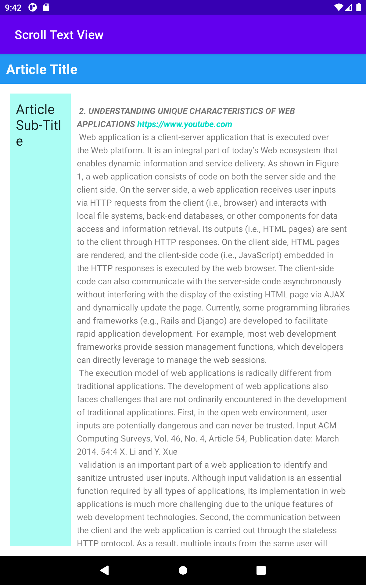

# Scrolling task view (HomeWork)
- In this task i have created multiple text view Elements.
- ScrollView elements defines a scrolling text within the relative layout.
- By the help of Linear Layout Article Sub-title is displayed on a side of the main Article paragraph.
- Those main paragraph shows the Scrolling Page of an article.
- In the article i have implemented an free format HTML tags in the paragraph.
- in this article there is also an web link which helps to navigate to the server.
- there is also an Comment button below the article.
## HomeWork view in GIF

## Project Images
